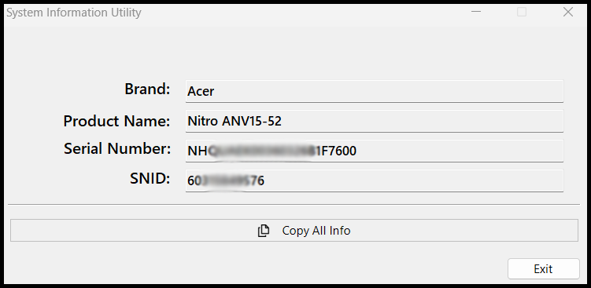

# System Information Utility

**System Information Utility** is a lightweight **.NET 10.0** Windows application that retrieves and displays essential hardware identifiers—Brand, Product Name, Serial Number, and SNID—in a clean, modern interface.

This project was inspired by the official [Acer System Information Tool](https://community.acer.com/en/kb/articles/56-acer-system-information-tool). While Acer’s tool exposes basic system identifiers, it restricts copying to only Serial Number and SNID. This utility removes those limitations, providing full visibility and instant copying for every field, including a one‑click “Copy All” option.


## Preview



## Features

* **Complete Hardware Identity:** Displays Brand, Product Name, Serial Number, and SNID in dedicated fields.
* **One‑Click Full Copy:** Instantly copy all system details to the clipboard.
* **Click‑to‑Copy Fields:** Clicking any field copies its individual value.
* **Modern Runtime:** Built on .NET 10.0 for fast startup, low memory usage, and compatibility with current Windows releases.
* **Minimal UI:** Clean, focused interface designed purely for quick system identification.

## Key Components

* **Single Responsibility Architecture:** All logic is isolated into dedicated classes—UI, interop, WMI, and utilities remain fully decoupled.
* **UI Layer (`MainForm.vb`):** Handles rendering, layout, and user interactions such as click‑to‑copy and full‑copy actions.
* **Native Interop (`NativeMethods.vb`):** Contains P/Invoke declarations and low‑level Windows API bindings.
* **Core Service Classes:** Retrieve, parse, and normalize hardware attributes (Brand, Model, Serial Number, SNID).
* **Resource Layer (`Resources/`):** Stores visual assets and screenshots separate from source code.

## Directory Structure

```
SystemInformation
|-- CoreServices
|   |-- UI
|   |   +-- DialogService.vb
|   |-- WindowsApiInterop
|   |   |-- Methods
|   |   |   |-- Classes
|   |   |   |   +-- SystemInfoModel.vb
|   |   |   |-- NativeMethods.vb
|   |   |   |-- SystemInfoCollector.vb
|   |   |   +-- SystemManufacturerQuery.vb
|   |   +-- ExternDll.vb
|   +-- WmiInterop
|       +-- Methods
|           |-- SystemModelQuery.vb
|           +-- SystemSerialNumberQuery.vb
|
|-- My Project
|   |-- Application.Designer.vb
|   +-- Resources.Designer.vb
|
|-- Resources
|
|-- Utilities
|   |-- ErrorHandling
|   |   |-- Win32Error.vb
|   |   +-- Win32Result.vb
|   +-- AcerSnidConverter.vb
|
|-- MainForm.Clipboard.vb
|-- MainForm.Designer.vb
+-- MainForm.vb
```

## Contributing Guidelines

Contributions, bug reports, and feature requests are welcome! To maintain clean code quality and structural consistency, please follow these guidelines when contributing to this repository:

### 1. General Rules
* **Follow SRP (Single Responsibility Principle):** Ensure all new logic is placed inside dedicated, single-purpose classes rather than bloating existing UI or interop components.
* **Maintain Directory Structure:** Keep Windows API interop under `WindowsApiInterop/` and WMI queries/methods inside `WmiInterop/Methods/`.
* **No UI Logic in Core Services:** Keep UI behavior inside `MainForm` or `UI/` classes; do not mix UI and system retrieval logic.
* **Clean Commits:** Write clear, concise commit messages describing the changes made (e.g., `Refactor: move WMI methods to dedicated directory`).

### 2. Development Workflow
1. **Fork the Repository:** Create a personal fork of the project on GitHub.
2. **Create a Feature Branch:** Branch out from `main` using a descriptive name:
   ```bash
   git checkout -b feature/your-feature-name
   ```
3. **Commit Your Changes:** Stage and commit your updates with meaningful messages:
   ```bash
   git add .
   git commit -m "Add: description of your changes"
   ```
4. **Push and Pull Request:** Push your branch to your fork and submit a Pull Request against the `main` branch:
   ```bash
   git push origin feature/your-feature-name      
   ```
